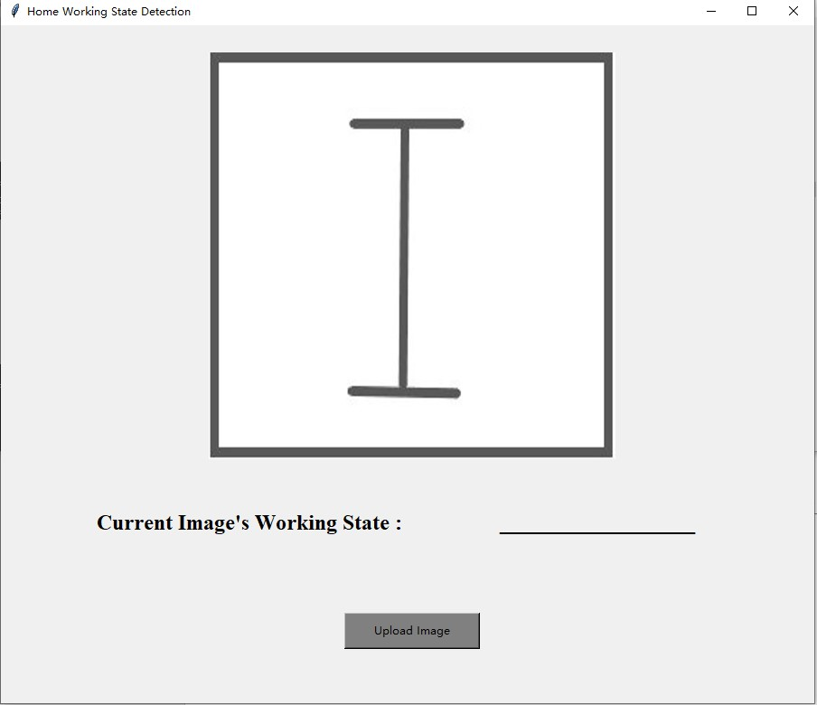

# Home_Working_Status_Analysis

Final project for 2021 PKUSZ@Digital Image Processing


## Prepare Dataset

Dataset is created from video frames. First copy corresponding video into the folder `data/video/{label_name}`, then run the script below.

```bash
cd data
python create_data.py -r 20
python split_train_test.py
```


## Train & Test

Simply run `src/train.py`, then you can train the home working status analysis model with 1750 images, and evaluate it with 250 images, finally testing best trained model with 500 images. ( train : eval : test = 7 : 1 : 2 )

```bash
python src/train.py \
	--ckpt_dir checkpoints/ \
    --epochs [train epoch num] --batch_size [train batch size] \
    --lr [learning rate] --device [gpu device id] --cuda [run with cuda]
```


## Demo

Simply run `sec/demo.py`, then you can upload home working image to detect its status, with the best trained model you have in `checkpoints/`. We mainly design GUI with `tkinter`, hope you would like its concise interface~

```bash
python src/demo.py \
	--ckpt_dir checkpoints/ \
	--device [demo run gpu device id] --cuda [run with cuda]
```

<div align=center></div>
